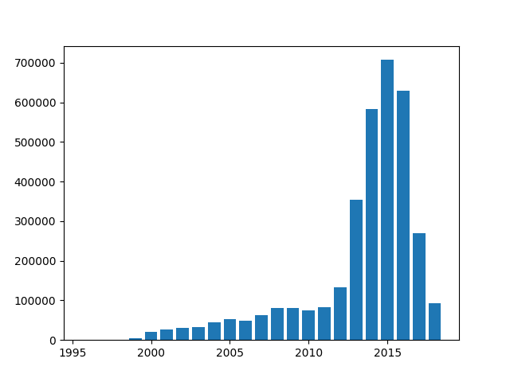

# Project title: sentiment-analysis-of-english- youtube-comments
## Team members: 
- Kushal Gaywala, kushal.gaywala@stud.uni-heidelberg.de
- Rishabh Tiwari, rishabh.tiwari@stud.uni-heidelberg.de
- Jonathan Alexander Hirsch, ww251@stud.uni-heidelberg.de 
- Jakob Forstmann, jakob.forstmann@stud.uni-heidelberg.de

## project structure:
- web-application contains the code for the webinterface. This includes the code used for fetching the youtube comments and the classification of the youtube comments
-  module_preparation contains the code for the training of our model with the youtube comments. Furthermore it includes the code for 
  loading the dataset and for storing and loading the datasets into elastic search
- data contains our results of our experiments as well as the used plots.
- experiments has its own [README](/experiments/Training.md) where you can find more information.

## How to setup the webinterface 
0) obtain a valid youtube API token. You can get one by creating a new project in the Google Cloud Console, enabling the YouTube Data API and creating a new API key in the API credentials section.

1) store your API Token in the file `web-application/backend/API/API_KEYS.py `like this:
```
file API_KEYS.py 
YOUTUBE_API_KEY =##your API Key 
``` 

2) start the backend, please follow the steps in this [README](/web_application/backend/README.md) for more information

3) start the frontend,please follow the steps in this [README](/web_application/frontend/README.md) for more information

## train our model using the already created youtube comments dataset:
Since the dataset is stored in elasticsearch you will need an running elastic search instance on your machine.
Furthermore you will need to create a file `credentials.py` in the folder module_preparation containg your elastic search user name and password.
After everthing is set up you can follow these steps to train our model:

1) install the neccessary requirements using the requirements.txt in the folder modul_preparation 

2) execute the file `training.py`.

## Project Milestone 12/12/2022 
## utilzed libraries: 
- <a herf="https://pandas.pydata.org/">Pandas</a> used to clean up the data
	## processing libraries:
	- <a herf="https://www.nltk.org/api/nltk.stem.html">Stem</a>: used  WordNet Lemmatizer for lematization
	- <a herf="https://www.nltk.org/api/nltk.corpus.html">Corpus</a>: used  to remove stopwords
	- <a herf="https://www.nltk.org/">NLTK</a>: used to preprocess the data
	- <a herf="">re</a>: used to implement regular expression during processing

- NLTK: used to preprocess the data
- re: used to implement regular expression during processing
- googleapiclient: used to fetch comments from youtube

## used dataset:
We trained our model with two different datasets and compared the results.
Our initial approach was to use the [amazon reviews dataset](https://nijianmo.github.io/amazon/index.html).
Since this dataset is fairly large we limited ourself to the 5 core datasets and chose five categories. From each category we included  about 2000 reviews in our training dataset.The five chosen categories are:
- All Beauty 
- Electronics 
- Home and Kitchen 
- Movie and TV 
- Software

The dataset originates from the following paper:

Justifying recommendations using distantly-labeled reviews and fined-grained aspects

Jianmo Ni, Jiacheng Li, Julian McAuley
Empirical Methods in Natural Language Processing (EMNLP), 2019

After training we tried to predict the sentiment of unseen youtube comments with our model. Unfortunately the resulting accuracy was only about 50% percent regardless which training method we used. So we decided to create our own smaller youtube dataset containg about 3000 randomly chosen youtube comments and their sentiment.


## Project State 12/12/2022:

### planning state:

- did the conversion of the dataframe from csv format to a pandas dataframe
- dropped unused columns, removed duplicated entries and convert from an five star rating into our three categories
- since the dataset is too huge to do prepocessing on the entire dataset we did the prepocessing only on about the first thousand
  entries of the dataset
- we are working on splitting the dataset using relevance sampling instead of using just the first thousand entries
- we implemented a module to get the comments from a video with a given ID using the Google API Client (we created a Google Developer Key for that purpose)

### Future planning:
- Rishabh and Jonathan are going to use linear Support Vector Machines (SVM) for our classification problem since they among the best models for Sentiment Analysis.
- they are going to use the data set for training and hyperparameter tuning of the SVM.
- finally the SVM should than be tested on comments from YouTube.
- Jakob will after he is done with the relevance sampling start to evaluate if any prepocessing is necessary for the raw comments fetched from youtube.
- Shortly after this is done we will start implement an API to acesss our model and the routes the user will use to acess the API
- Lastly we will implement the website most likely using svelte-kit
- Kushal will learn about how to make this project into a full-stack application from the fast-api to the front-end, back-end part and all of the other frameworks.

### High-level-architecture design:

- the conversion,the sampling and the statistics about the dataset are all in seperates classes
- They will, combinded with the code for the prepocessing, eventually become part of the module prepocessing
- to spit the entire dataset in a smaller dataset one has to follow three steps:
  - set the number of splitted file the entire dataset was split into
  - call converter.convert_to_dataframe() and converter.clean_data()
  - finally to call the code for the samling one has to use the statistics class to compute the number of reviews per sentiment
- after the orignal dataset was split into a smaller one, we can then proceed with the prepocessing definied in prepocessing.py

#### preprocessing pipeline
- The code for the code conversion into dataframe was pre-written by Jakob, we used pandas dataframe for the data processing.
- We first tried it doing it using the whole dataset but it overloaded my RAM(8GB) then we tried different methods as follows:
  - We first tried to use the code from the paper but it does not increase the performance so we ditched that idea.
  - Installing linux as secondary OS and increasing the swapped memory but it did not work.
  - Then, We tried to split files into 9 different files and again it was the same issue.
  - We also tried to process by converting into a zip format but neither of the methods increased the performance.
  - So, We settled on using only using 1 file and after we were satisfied with the normalized data.
- For the normalization of the data, We used NLTK library and it's different modules like:
  - Stem: Used WordNet Lemmatizer for lematization of the tokens after tokenization.
  - Snowball: Used snowball stemmer but it reduces an token to root form more than expected at that point it is not really a human understanble word, so didn't stemmed the data.
  - Corpus: Used to remove stopwords form the dataset
- re: It is a python module used to implement regular expression during processing to remove the unnecessary punctuations.
#### Example of the Preprocessing:
| overall | verified | reviewTime  | reviewerID     | asin       | style           | reviewerName | review_text               | summary | unixReviewTime |
| ------- | :------- | :---------- | :------------- | :--------- | :-------------- | :----------- | :------------------------ | :------ | :------------- |
| 5.0     | true     | 03 11, 2013 | A3478QRKQDOPQ2 | 0001527665 | Format: VHS Tape | jacki       | really happy they got evangelised .. spoiler alert==happy ending liked that..since started bit worrisome... but yeah great stories these missionary movies, really short only half hour but still great | great | 1362960000     |

After preprocessing:
- I cannot really see the lemmatization part of the processing in the normalized data and the stemming was overdone so did not use it, I think I am not able to understand it properly.
| overall | verified |
| --------| ---------|
| postive |really happy got evangelised spoiler alert==happy ending liked since started bit worrisome yeah great story missionary movie really short half hour still great|

### Data-Analysis:

#### statistics

- number of samples: 3410019

- number of positives reviews: 2694711

- number of negative reviews: 365608

- number of neutral reviews: 349700

number of revies per year



Because this dataset with 3410019 reviews is to big to perform to do preprocessing we are working on splitting the dataset to a choosen number of reviews.
For the smaller dataset we will test if keeping the unbalanced distribution is better or distributing the number of reviews per category equally.

#### example from the dataset

| overall | verified | reviewTime  | reviewerID     | asin       | style           | reviewerName | review_text               | summary | unixReviewTime |
| ------- | :------- | :---------- | :------------- | :--------- | :-------------- | :----------- | :------------------------ | :------ | :------------- |
| 5.0     | true     | 04 12, 2016 | A2CFV9UPFTTM10 | 0005419263 | Format:Audio CD | SuzieQ       | The little ones love this | Love it | 1460419200     |

We will only work with the columns overall and review_text,since we are not interested in all other columns.

## project log

Date: 15/11/22 Rishabh and Jonathan:
1) https://scikit-learn.org/stable/tutorial/text_analytics/working_with_text_data.html - for the pipelining of the data and more traditional models.
2) https://www.tensorflow.org/tutorials - To train the data 
3) We studied about the sickit learn tutorial/implemented it/learning the usage of the sickit learn for the vectorization and training the data set. 

Date: 20/11/22 Rishabh and Jonathan:

1) We continued to study scikit learn and its usage for text analysis.

Date 27/11/22 Jakob 

I splitted the amazon dataset in nine smaller files each about 200 MB so the cleaning the data becomes  possible on my machine
Furthermore I removed  entries with the same text and rating, removedunused columns and converted the initally five star rating into our three categories.

Date: 01/12/22 - 04/12/22 Kushal

1) Tried many ways by which I can read and process such huge dataset  in my computer.
2) Methods I tried to use:
	a) Spliting the data into more than 9 files
	b) Installed a linux distro and used swap memory(10GB) as extension to RAM(8GB) but it also didn't worked.
3) Atlast after unable to find a feasible method. We settled on the idea to use reduced dataset.

Date 4/12/22 - 12/12/22: Jakob 

I tried to randomly pick  an equal amount of reviews from each splitted files. However executing this code 
takes quite a while and the code currenlty only works if a number of reviews divisiable by 9 is chosen.

Date: 05/12/22 Kushal

1) Now I just used a single file from the multiple splited to do the pre-processing and tesitng of the code.

Date 12/11/22 Rishabh and Jonathan:

1) We studied about Fitting and predicting: estimator basics
2) Transformers and pre-processors
3) Pipelines: chaining pre-processors and estimators
4) Model evaluation


Next steps would be: We would like to train the model using vector machines. 


16/12/22 Rishabh and Jonathan:
1) We extracted the first 15 youtube comments from the random youtube videos irrespective of its genre.
2) We took approximately 3000 comments.


23/12/22 Rishabh and Jonathan: 

1) We finished extracting the 3000 youtube comments.
2) We pre processed the youtube comments to make it easier for labelling.
3) We started labelling the comments manually as Postive, negative and Neutral for further training. 


After this we intend to start training our models using vector machines. 

18/01/2023 Rishab Jonathan and Jakob 

We wrote different pipelines and compared the impact of these on the training results using the amazon review data

06/02/2023 Rishabh and Jonathan:

We are done with pre-processing and training the model. 
